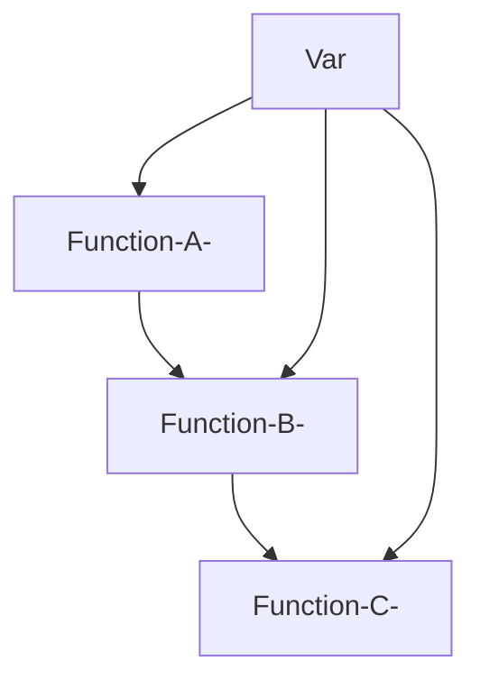
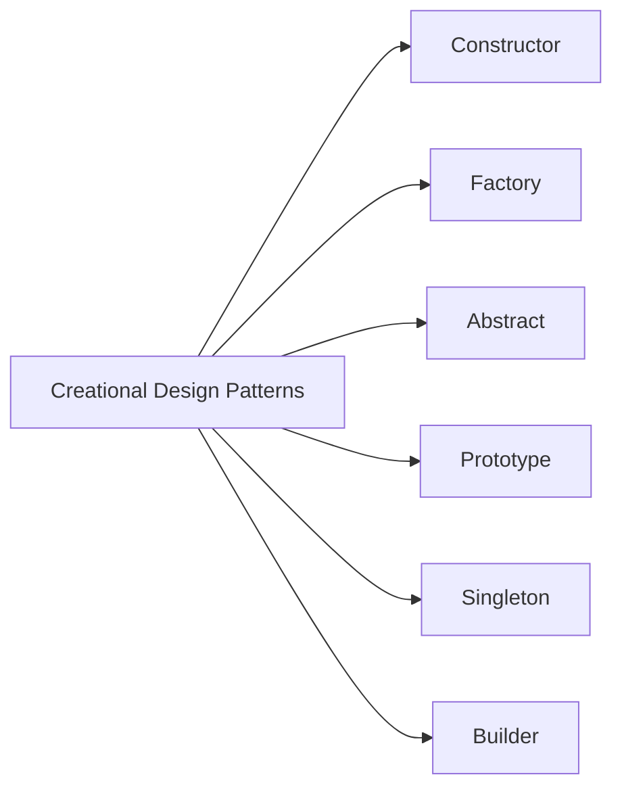
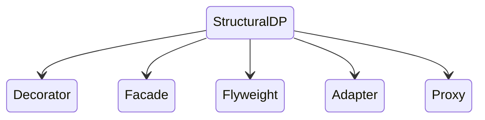
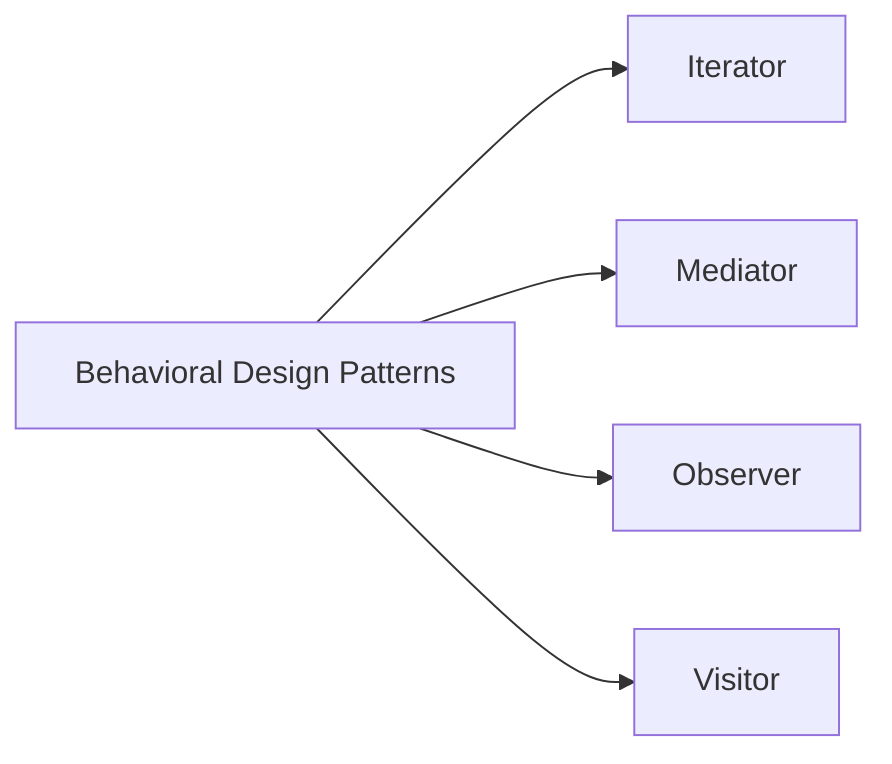

# Intro to Design Patterns:

> <strong> Language utilize : javaScript. </strong>

## Table Of Contents:
<ol>
  <li>
     Scope:
      <ul>
        <li>What is Scope?</li>
        <li>What is Global Scope?</li>
        <li>What is Local Scope?</li>
        <li>Function Scope.</li>
        <li>Lexical Scope.</li>
        <li>Scope chain.</li>
        <li>Scope & 'this'.</li>
        <li>call(), apply() & bind().</li>
        <li>Closures.</li>
      </ul>
  </li>
  <li>
    IIFE's.
  </li>
  <li>
    Intro to Public & Private -in javaScript !-.
  </li>
  <li>
    Patterns:
    <ul>
      <li>What is a Pattern?</li>
      <li>Anti-Patterns.</li>
      <li>Writing Design Patterns.</li>
      <li>Categories Of Design Pattern.</li>
      <li>Import & Export </li>
      <li>Getter & Setter</li>
      <li>JS Design Patterns:
          <ul>
            <li>Constructor Pattern.</li>
            <li>Module Pattern.</li>
            <li>Revealing Module Pattern.</li>
            <li>Singleton Pattern.</li>
            <li>Observer Pattern.</li>
            <li>Mediator Pattern.</li>
            <li>Prototype Pattern.</li>
            <li>Command Pattern.</li>
            <li>Facade Pattern.</li>
            <li>Factory Pattern.</li>
            <li>Mixin Pattern.</li>
            <li>Decorator Pattern.</li>
            <li>Flyweight Pattern.</li>
          </ul>
      </li>
    </ul>
  </li>
</ol>

*****************************************************************

# The Scope :

## What is Scope ?
<p>In JavaScript, scope refers to the current context of your code.
Scopes can be globally or locally defined. 
Understanding JavaScript scope is key to writing bulletproof code 
and being a better developer.
You’ll understand where variables/functions are accessible,
be able to change the scope of your code’s context and be able to write
faster and more maintainable code, as well as debug much faster.
</p>

<h5>  
  First of all, take a look at this 
<a  href="https://wesbos.com/javascript-scoping"> 
  Article
</a>
.
</h5>

## Global Scope :

A GLOBAL variable can be accessed from any script or function.
  <ul>
    <li>
      A global variable has Global Scope:
      All scripts and functions on a web page can access it. 
    </li>
    <li>
      Variables declared with `var`,
      `let` and `const` are quite similar when declared outside a block
    </li>
  </ul>

```javascript
// Global Scope

var x = 2;

let x = 2;

const  = 2;

/////     the functions writing below

// ... 
```

## Local Scope :

Variables declared within a JavaScript function, become LOCAL to the function.

```javascript
  var myFunction = ()=>{
    // Local var =(mean)= Local Scope
    var name = 'Omar';
    console.log(name)  // Omar
  };
  
  // uncaught ReferenceError : name is not defined
  console.log(name);
```

## Function Scope :

<ul>
  <li>JavaScript has function scope: Each function creates a new scope.</li>
  <li>Variables defined inside a function are not accessible (visible) from outside the function.</li>
  <li>Variables declared with `var`, `let` and `const` are quite similar when declared inside a function.</li>
</ul>

<h5> They all have <strong>Function Scope</strong>: </h5>

```javascript
  // Scope A
    var myFunction = ()=>{
      // Scope B
      const myOtherFunction = ()=>{
        // Scope C
       }; 
    };  
```
************************************************************
<h3>Warning!!</h3>
<ul>
  <li>Do NOT create global variables unless you intend to.</li>
  <li>Your global variables (or functions) can overwrite window variables (or functions).</li>
  <li>Any function, including the window object, can overwrite your global variables and functions.</li>
</ul>

********************************************************
<h3>The Lifetime of JavaScript Variables:</h3>
<ul>
  <li>The lifetime of a JavaScript variable starts when it is declared.</li>
  <li>Function (local) variables are deleted when the function is completed.</li>
 <li>In a web browser, global variables are deleted when you close the browser window (or tab).</li>
</ul>


## Lexical Scope :

Whenever you see a function within another function, the inner function has access to the scope in the outer function, this is called Lexical Scope or Closure - also referred to as Static Scope. The easiest way to demonstrate that again:

```javascript
var name = 'Todd';
var scope1 = function () {
  // name is available here
  var scope2 = function () {
    // name is available here too
    var scope3 = function () {
      // name is also available here!
    };
  };
};

```

<h5>
  The only important thing to remember is that Lexical scope does not work        backwards. Here we can see how Lexical scope doesn’t work:
</h5>

```javascript
// name = undefined
var scope1 = function () {
  // name = undefined
  var scope2 = function () {
    // name = undefined
    var scope3 = function () {
      var name = 'Todd'; // locally scoped
    };
  };
};

```

Simple idea :




## Scope Chain :

Scope chains establish the scope for a given function. Each function defined has its own nested scope as we know, and any function defined within another function has a local scope which is linked to the outer function - this link is called the chain. It’s always the position in the code that defines the scope. When resolving a variable, JavaScript starts at the innermost scope and searches outwards until it finds the variable/object/function it was looking for.


```javascript
  var a = 'Hello,...';
  function first(){
      var b = 'How are you? ';
      secand();
      
      function secand(){
        var c = 'Can I help you ?';
        console.log(a+b+c);         
        // this function is included in the scope chain 
        // so it return :
        //  Hello...How are you? Can I help you ?
        
        three();
        // return : b is not defined at three , secand... not in the Scope chain 
    };
   
   function three(){
      var d = ' Yes please! ';
      console.log(a+b+c+d);
      };
      
 
  first();
 
```


## Scope and -this- :

Each scope binds a different value of this depending on how the function is invoked. We’ve all used the this keyword, but not all of us understand it and how it differs when invoked. By default this refers to the outer most global object, the window. We can easily show how invoking functions in different ways binds the this value differently:


```javascript
   myFunction = () => {
    console.log(this); // this = global, [object Window]
    };
myFunction();

  var myObject = {};
   myObject.myMethod =  () => {
   console.log(this); // this = Object { myObject }
};

var nav = document.querySelector('.nav'); // <nav class="nav">
toggleNav =  () => {
  console.log(this); // this = <nav> element
};
nav.addEventListener('click', toggleNav, false);

```

There are also problems that we run into when dealing with the this value, for instance if I do this, even inside the same function the scope can be changed and the this value can be changed:


```javascript
  const nav = document.querySelector('.nav'); // <nav class="nav">
  toggleNav =  () => {
  console.log(this); // <nav> element
  setTimeout( () => {
    console.log(this); // [object Window]
  }, 1000);
};
nav.addEventListener('click', toggleNav, false);

```

This is a neat little trick to be able to use the proper this value and resolve problems with newly created scope:

```javascript
  const  nav = document.querySelector('.nav'); // <nav class="nav">
  toggleNav = () => {
  var that = this;
  console.log(that); // <nav> element
  setTimeout( () => {
    console.log(that); // <nav> element
  }, 1000);
};
nav.addEventListener('click', toggleNav, false);

```

## Call(), Apply() & Bind() :

```javascript
  var links = document.querySelectorAll('nav li');
  for (var i = 0; i < links.length; i++) {
    console.log(this); // [object Window]
}

```

<strong>  The `This` value here doesn't refer to our elements, we aren't 
      invoking anything or changing the scope!!
</strong>

#### .call() and .apply() :

The .call() and .apply() methods are really sweet, they allows you to pass in a scope to a function, which binds the correct this value. Let’s manipulate the above function to make it so that our this value is each element in the array:


```javascript
  const links = document.querySelectorAll('nav li');
  for (let i = 0; i < links.length; i++) {
  (() => {
    console.log(this);
  }).call(links[i]);
}
```

We can use either `.call()` or `.apply()` to change the scope, but any further arguments are where the two differ: `.call(scope, arg1, arg2, arg3)` takes individual arguments, comma separated, whereas `.apply(scope, [arg1, arg2])` takes an Array of arguments.

It’s important to remember that using `.call()` or `.apply()` actually invokes your function, so instead of doing this:

```javascript
  myFunction(); // invoke myFunction
```
You’ll let `.call()` handle it and chain the method:


```javascript
  myFunction.call(scope); // invoke myFunction using .call()
```

### .bind() :

Unlike the above, using .bind() does not invoke a function, it merely binds the values before the function is invoked.

 As you know we can’t pass parameters into function references, something like this:
 
 ```javascript
    // works
   nav.addEventListener('click', toggleNav, false);

     // will invoke the function immediately
   nav.addEventListener('click', toggleNav(arg1, arg2), false);
 ```

We can fix this, by creating a new function inside it:

 ```javascript
    nav.addEventListener('click', function () {
      toggleNav(arg1, arg2);
    }, false);
 ```

But again this changes scope and we’re creating a needless function again, which will be costly on performance if we were inside a loop and binding event listeners. This is where `.bind()` shines through, as we can pass in arguments but the functions are not called:


```javascript
  nav.addEventListener('click', toggleNav.bind(scope, arg1, arg2), false);
```

The function isn’t invoked, and the scope can be changed if needed, but arguments are sat waiting to be passed in.

******************************************************************


## Closures :

Closures ties in very closely with Lexical Scope. A better example of how the closure side of things works, can be seen when returning a function reference - a more practical usage. Inside our scope, we can return things so that they’re available in the parent scope:


```javascript
  sayHello = (name) => {
  let text = 'Hello, ' + name;
    return  () => {
      console.log(text);
  };
};

sayHello('Todd'); // nothing happens, no errors, just silence... !!!!!
```

The closure concept we’ve used here makes our scope inside sayHello inaccessible to the public scope.

The function returns a function, which means it needs assignment, and then calling:


```javascript
  var helloTodd = sayHello('Todd');
  helloTodd(); // will call the closure and log 'Hello, Todd'
```

<strong> OR </strong>

```javascript
  sayHello('Bob')(); // calls the returned function without assignment
```
A function doesn’t have to return in order to be called a closure though. Simply accessing variables outside of the immediate lexical scope creates a closure.


****************************************************************

# IIFE : 

<strong> 
  IIFE -pronounced: iffy- : Immediately Invoked Function Expression.
</strong>

It doesn't take very long working with JavaScript before you come across this pattern:

```javascript
  ( ()=>{       // anonymouse function !!
   /////////// Expression zone //////////
   //your code    
   /////////////////////////////////////
  })();    
  // (...) if your anonymouse function has an argument or invoke another function. 

// another way to defined iife
  !()=>{
    // ....
    }();
    
  +()=>{
    // ....
  }();
  
  ~() =>{
    // ....
  }();
  
  -() =>{
    // ....
  }();
```


<h3>  Note :  </h3>

<strong>
  the Normal way to create a simple function / function myFunction(){...}/
  named a `function declaration`.
</strong>


***********************************************


  The primary reason to use an IIFE is to obtain data privacy.The primary reason      to use an IIFE is to obtain data privacy.
  
 ```javascript
  ( () => {
    let foo = "bar";

    // Outputs: "bar"
    console.log(foo);
})();

// ReferenceError: foo is not defined
console.log(foo);
 ```
Of course, you could explicitly name and then invoke a function to achieve the same ends:

```javascript
  let foo = "foo";

( (innerFoo) => {
    // Outputs: "foo"
    console.log(innerFoo);
})(foo);

```
Another Example :

```javascript
  const documentMock = (() => ({
    querySelector: (selector) => ({
      innerHTML: null,
     }),
  }))();

const Formatter = ((doc) => {
  const log = (message) => console.log(`[${Date.now()}] Logger: ${message}`);

  const makeUppercase = (text) => {
    log("Making uppercase");
    return text.toUpperCase();
  };

  const writeToDOM = (selector, message) => {
    doc.querySelector(selector).innerHTML = message;
  }

  return {
    makeUppercase,
    writeToDOM,
  }
})(document || documentMock);

```


# Public & private : 

Now, after this introduction, we will move to the public/private Scope;
<ul>
  <li>
In many programming languages, you’ll hear about public and private scope, in JavaScript there is no such thing. We can, however, emulate public and private scope through things like Closures.
  </li>
  <li>
By using JavaScript design patterns, such as the Module pattern for example, we can create public and private scope. A simple way to create private scope, is by wrapping our functions inside a function. As we’ve learned, functions create scope, which keeps things out of the global scope:
  </li>
</ul>


<strong>
  For example:
</strong>

```javascript
  (function () {
    // private scope inside here
  })();

////  another example 

  (function () {
    const myFunction = function () {
    // do some stuff here
  };
})();

//// another one, when we come to calling our function, it would be out of scope:

(function () {
  let myFunction = function () {
    // do some stuff here
  };
})();

myFunction(); // !! Uncaught ReferenceError: myFunction is not defined

```

<p>
Success! We’ve created private scope. But what if I want the function to be public? There’s a great pattern (called the Module Pattern [and Revealing Module Pattern]) which allows us to scope our functions correctly, using private and public scope and an Object. Here I grab my global namespace, called Module, which contains all of my relevant code for that module:
</p>

<ul>
  <li>
    <h3> Simple example: </h3>

```javascript
  // define module
    const  Module = (function () {    // iife
      return {    // public methods 
                myMethod: function () { 
                console.log('myMethod has been called.');
       }
  };
})(); 

// call module + methods

Module.myMethod();

```
</li>

  <li>
    <h3> what about private methods? </h3>
    
```javascript
    const Module = (function () {
    let privateMethod = function () { //...};
      return {
        publicMethod: function () {// ...    }
      };
    })();
```
    
<p>
This means that publicMethod can be called, but privateMethod cannot, as it’s privately scoped! These privately scoped functions are things like helpers, addClass, removeClass, Ajax/XHR calls, Arrays, Objects, anything you can think of.
 </p>Commi

  </li>
    <li>
      <h3>  Access the Private method : </h3>
      
```javascript
  const Module = (function () {
  let privateMethod = function () {
  };
  return {
    publicMethod: function () {
      // has access to `privateMethod`, we can call it:
      // privateMethod();
    }
  };
})();
```
<p>
This allows a very powerful level of interactivity, as well as code security. A very important part of JavaScript is ensuring security, which is exactly why we can’t afford to put all functions in the global scope as they’ll be publicly available, which makes them open to vulnerable attacks.
  </p>
  </li>
  
  <li>
    <h3> Return an `Object`: </h3>
      
  Here’s an example of returning an Object, making use of public and private      methods:

```javascript
  cosnt Module = (function () {
  const myModule = {};
  const privateMethod = function () {

  };
  myModule.publicMethod = function () {

  };
  myModule.anotherPublicMethod = function () {

  };
  return myModule; // returns the Object with public methods
})();

// usage
    
Module.publicMethod();

```
  </li>
  
  <li>
    <h3> Underscore : Private view </h3>
  <p>
    This helps us when returning an anonymous Object, which the Module can use in Object fashion as we can simply assign the function references:
  </p>
    
```javascript
  const Module = (function () {
  let _privateMethod = function () {

  };
  let publicMethod = function () {
  };
    
  return {
    publicMethod: publicMethod,
    anotherPublicMethod: anotherPublicMethod
  }
})();

 ```
  
  </li>
</ul>
    
  ****************************************************************
  
  # Patterns :
  
  
  ## What is a Pattern? :
  
  A pattern is a reusable solution that can be applied to commonly occurring problems in software design - in our case - in writing JavaScript web applications. Another way of looking at patterns are as templates for how we solve problems - ones which can be used in quite a few different situations.


So, why is it important to understand patterns and be familiar with them? Design patterns have three main benefits:

<ol>
  <li>Patterns are proven solutions.</li>
  <li>Patterns can be easily reused.</li>
  <li>Patterns can be expressive.</li>
</ol>


Patterns are not an exact solution. It’s important that we remember the role of a pattern is merely to provide us with a solution scheme. Patterns don’t solve all design problems nor do they replace good software designers, however, they do support them;

<ul>
  <li>
    Reusing patterns assists in preventing minor issues that can cause major         problems in the application development process. 
  </li>
  <li>
    Patterns can provide generalized solutions which are documented in a fashion     that doesn't require them to be tied to a specific problem.
  </li>
  <li>
    Certain patterns can actually decrease the overall file-size footprint of       our code by avoiding repetition. 
  </li>
  <li>
    Patterns add to a developer's vocabulary, which makes communication faster.
  </li>
  <li>
    Patterns that are frequently used can be improved over time by harnessing       the collective experiences other developers using those patterns contribute     back to the design pattern community. 
  </li>
</ul>


## Anti-Pattern :

If we consider that a pattern represents a best practice, an anti-pattern represents a lesson that has been learned. The term anti-patterns was coined in 1995 by Andrew Koenig in the November C++ Report that year, inspired by the GoF's book Design Patterns. In Koenig’s report, there are two notions of anti-patterns that are presented. Anti-Patterns:


<ul>
  <li>
    Describe a bad solution to a particular problem which resulted in a bad         situation occurring.
  </li>
  <li>
     Describe how to get out of said situation and how to go from there to a          good solution.
  </li>
</ul>


## Writing Design pattern :

A fundamental understanding of how a design pattern is written can offer a number of useful benefits.


Writing good patterns is a challenging task. Patterns not only need to (ideally) provide a substantial quantity of reference material for end-users, but they also need to be able to defend why they are necessary.

When we're looking at a body of code we think may be using a pattern, we should consider writing down some of the aspects of the code that we believe falls under a particular existing pattern or set of patterns.

In many cases of pattern-analysis we can find that we're just looking at code that follows good principles and design practices that could happen to overlap with the rules for a pattern by accident. Remember - solutions in which neither interactions nor defined rules appear are not patterns.

If interested in venturing down the path of writing your own design patterns,
it is recommend learning from others who have already been through the process and done it well. Spend time absorbing the information from a number of different design pattern descriptions and take in what’s meaningful to you.

Explore structure and semantics - this can be done by examining the interactions and context of the patterns you are interested in so you can identify the principles that assist in organizing those patterns together in useful configurations.

Once we've exposed ourselves to a wealth of information on pattern literature, we may wish to begin writing our pattern using an existing format and see if we can brainstorm new ideas for improving it or integrating our ideas in there.


The following are tips if interested in creating a new design pattern:

<ul>
  <li>
    How practical is the pattern?: Ensure the pattern describes proven solutions    to recurring problems rather than just speculative solutions which haven’t      been qualified.
  </li>
  <li>
    Keep best practices in mind: The design decisions we make should be based on      principles we derive from an understanding of best practices.
  </li>
  <li>
    Our design patterns should be transparent to the user: Design patterns          should be entirely transparent to any type of user-experience. They are           primarily there to serve the developers using them and should not force         changes to behavior in the user-experience that would not be incurred           without the use of a pattern.
  </li>
  <li>
    Remember that originality is not key in pattern design: When writing a pattern, we do not need to be the original discoverer of the solutions being documented nor do you have to worry about our design overlapping with minor pieces of other patterns. If the approach is strong enough to have broad useful applicability, it has a chance of being recognized as a valid pattern.
  </li>
  <li>
    Patterns need a strong set of examples: A good pattern description needs to be followed by an equally strong set of examples demonstrating the successful application of our pattern. To show broad usage, examples that exhibit good design principles are ideal.
  </li>
</ul>


Pattern writing is a careful balance between creating a design that is general, specific and above all, useful. Try to ensure that if writing a pattern you cover the widest possible areas of application and you should be fine.

**************************************************************

### When to use var, const and let :

This book includes a number of code examples using `var`, `const` and `let`. The difference between `var`, `const` and `let` is that `var` is a block-scoped variable, `const` is a block-scoped constant and `let` is a block-scoped variable that is only accessible within the block it is declared in. Often, you will want to use `let` but if you want to avoid variable assignment, you can use `const` instead. Ultimately, use the convention already in the codebase you're using.

**************************************************************

## Categories Of Design Pattern :

<ol>
  <li>
    <h4>  Creational Design Patterns: </h4>
    <p>
      Creational design patterns focus on handling object creation mechanisms where objects are created in a manner suitable for the situation we're working in. The basic approach to object creation might otherwise lead to added complexity in a project whilst these patterns aim to solve this problem by controlling the creation process.
    </p>
    
    


    
  </li>
  
  <li>
    <h4> Structural Design Patterns: </h4>
    <p>
      Structural patterns are concerned with object composition and typically identify simple ways to realize relationships between different objects. They help ensure that when one part of a system changes, the entire structure of the system doesn't need to do the same. They also assist in recasting parts of the system which don't fit a particular purpose into those that do.
    </p>  
    

  
  </li>
  
  <li>
    <h4> Behavioral Design Patterns: </h4>
    <p>
      Behavioral patterns focus on improving or streamlining the communication between disparate objects in a system.
    </p>
    

  </li>
</ol>


************************************************************

## Import 📥 & Export 📤 :

Modules allow us to separate our application code into independent units each containing code for one aspect of the functionality. Modules also encourage reusability of code and expose features that can be integrated into different applications.

To support modular programming, the language should have features that allow you to import module dependencies and export the module interface (the public API/variables we allow other modules to consume). This support for JavaScript Modules (also referred to as ES Modules) was introduced to JavaScript in ES2015, which allows you to succinctly specify module dependencies using an import keyword. Similarly, the export keyword can be used to export just about anything from within the module.

<ul>
  <li>
    <strong>  Import 📥 </strong> declarations bind a module's exports as local variables and may be renamed to avoid name collisions/conflicts.
  </li>
  <li>
    <strong> Export 📤 </strong> declarations declare that a local binding of a module is externally visible such that other modules may read the exports but can't modify them. Interestingly, modules may export child modules but can't export modules that have been defined elsewhere. We can also rename exports so their external name differs from their local names.
  </li>
</ul>

## Simple example :

```javascript 

  // ----------- lib.js ------------
  export const sqrt = Math.sqrt;
  export function square(x){
    return x*x;
  }
  export function diag(x,y){
    return sqrt(square(x) + square(y));
  }
  
  
  // IMOPORT PART OF A MODULE
  
 // ---------- main.js -----------  
 import {square,diag} from 'lib';
 console.log(square(11));
 console.log(diag(4,3));
  

//  IMPORT COMPLETE MODULE 

// ------------main.js ------------
import * as lib from 'lib';
console.log(lib.square(11));
console.log(lib.diag(4,3));


//  IMPORT WITH MORE CONVENIENT ALIAS 
import {reallyReallyLongModuleMemberName as shortName}
  from 'my-Module';
  
  
//  SINGLE DEFAULT EXPORT 

// --------- myFunc.js -------------
export default function () {...} // no semicolon!

// ------------- main.js -----------
import myFunc from 'myFunc';
myFunc();

```


```javascript
  // Filename: staff.mjs
// =========================================
// specify (public) exports that can be consumed by other modules
export const baker = {
   bake(item) {
      console.log( `Woo! I just baked ${item}` );
    }
};

// Filename: cakeFactory.mjs
// =========================================
// specify dependencies
import baker from "/modules/staff.mjs";

export const oven = {
    makeCupcake(toppings) {
       baker.bake( "cupcake", toppings );
    },
    makeMuffin(mSize) {
        baker.bake( "muffin", size );
    }
}

// Filename: bakery.mjs
// =========================================
import {cakeFactory} from "/modules/cakeFactory.mjs";
cakeFactory.oven.makeCupcake( "sprinkles" );
cakeFactory.oven.makeMuffin( "large" );

```

<h3>  Note: </h3>
<strong> 
  **.mjs** is an extension used for JavaScript modules that helps us distinguish      between module files and classic scripts (.js).
 </strong>
 
 ```javascript
  <script type="module" src="main.mjs"></script>
  <script nomodule src="fallback.js"></script>
 ```
 The `nomodule` attribute tells modern browsers not to load a classic script as a module. This is useful for fallback scripts that don't use the module syntax. It allows you to use the module syntax in your HTML and have it work in browsers that don't support it. This is useful for a number of reasons, including performance. Modern browsers don't require polyfilling for modern features, allowing you to only serve larger transpiled code to legacy browsers.

In the browser, module scripts are only evaluated once while classic scripts get evaluated as often as they are added to the DOM. This means that with JS modules, if you have a module that depends on a module that depends on a module that depends on a module, the module that depends on the innermost module will be evaluated first. This is a good thing because it means that the innermost module will be evaluated first and will have access to the exports of the modules that depend on it.


*****************************************************
### Modules Loaded From Remote Sources :

ES2015+ also caters for modules which are remotely based (e.g. third-party libraries) making it simplistic to load modules in from external locations. Here's an example of pulling in the module we defined above and utilizing it:

```javascript
  import {cakeFactory} from "https://example.com/modules/cakeFactory.mjs"; 
  //  eagerly loaded static import
  
  cakeFactory.oven.makeCupcake( "sprinkles" );
  cakeFactory.oven.makeMuffin( "large" );
```

### Dynamic Imports :


The type of import discussed above is called static import. With static import, the module graph needs to be downloaded and executed before the main code can run. This can sometimes lead to over-eagerly loading a lot of code upfront on initial page-load, which can be expensive and delay key features being available earlier.

```javascript
import {cakeFactory} from "/modules/cakeFactory.mjs";
// eagerly loaded static import

cakeFactory.oven.makeCupcake( "sprinkles" );
cakeFactory.oven.makeMuffin( "large" );
```

****************************************************
## getter & setter : 

<h4> 
  Just like literal objects, classes may include getters/setters, computed properties etc.
</h4>
<p>
Here’s an example for user.name implemented using get/set:
</p>

```javascript
class User {

  constructor(name) {
    // invokes the setter
    this.name = name;
  }

  get name() {
    return this._name;
  }

  set name(value) {
    if (value.length < 4) {
      alert("Name is too short.");
      return;
    }
    this._name = value;
  }

}

let user = new User("John");
alert(user.name); // John

user = new User(""); // Name is too short.
```

<p> Another Example : </p>

```javascript
  class Rectangle {
  constructor(height, width) {
    this.height = height;
    this.width = width;
  }
  // Getter
  get area() {
    return this.calcArea();
  }
  // Method
  calcArea() {
    return this.height * this.width;
  }
}

const square = new Rectangle(10, 10);

console.log(square.area); // 100
```

*****************************************************

## JS Design Patterns :

### The Constructor Pattern : 

<h4> 
  In classical object-oriented programming languages, a constructor is a special method used to initialize a newly created object once memory has been allocated for it. 
</h4>


Object constructors are used to create specific types of objects - both preparing the object for use and accepting arguments which a constructor can use to set the values of member properties and methods when the object is first created.


<h4>
  Object Creation:
  The three common ways to create new objects in JavaScript (ES2015+) are as follows:
</h4>

```javascript 
  // ES2015+ keywords/syntax used: const
// Each of the following options will create a new empty object

const newObject = {};

// or
const newObject = Object.create(Object.prototype);

// or
const newObject = new Object();
```

<h3>
  Basic Constructors :
</h3>

The concept of classes was introduced in ES2015 allows us to define templates for JavaScript Objects. They allow us to implement encapsulation and inheritance using JavaScript.

In the following declaration of a class, we have used the keyword class. Classes must include and declare a method named constructor().


```javascript
  // ES2015+ keywords/syntax used: let, class, constructor, 
//          template literals for string interpolation

class Car {
    constructor(model, year, miles) {
        this.model = model;
        this.year = year;
        this.miles = miles;
    }

    toString() {
        return `${this.model} has done ${this.miles} miles`;
    }
}

// Usage:

// We can create new instances of the car
let civic = new Car('Honda Civic', 2009, 20000);
let mondeo = new Car('Ford Mondeo', 2010, 5000);

// and then open our browser console to view the
// output of the toString() method being called on
// these objects
console.log(civic.toString());
console.log(mondeo.toString());
```
*****************************************

<h3> Note!</h3>
<h5>
  Sometimes people say that class is a “syntactic sugar” (syntax that is designed to make things easier to read, but doesn’t introduce anything new), because we could actually declare the same thing without using the class keyword at all:
</h5>

<br>
<h4> <a href="https://javascript.info/class"> For More about Class using in ES6. </a>
  <br>
  ****************************************
<h4>
    IS class in ES6 is bad ??
  </h4>
  <strong>  It’s A “Good” Part Because: </strong>
  <ol>
    <li>
      Class is something everyone learns and making the syntax better is a good thing.
    </li>
    <li>
      It’s an optional feature and there are other ways to create objects like factory functions.
    </li>
    <li>
      Using it for limited purposes is fine.
    </li>
  </ol>
  
  <strong> It’s A “Bad” Part Because: </strong>
  <ol>
    <li>
      The concept of “Class” doesn’t exist in JavaScript.
    </li>
    <li>
      Concept of classes makes things brittle. Prototypes are better and very flexible.
    </li>
    <li>
      It guides people away from goodness and power of functional programming.
    </li>
  </ol>
  ****************************************
  
<h3>
  Constructors with Prototypes:
</h3>

<h4> The `constructor()`  method is called automatically by new, so we can initialize the object there.

</h4>

```javascript
  // ES2015+ keywords/syntax used: let, class, constructor, 
//          template literals for string interpolation

class Car {
    constructor(model, year, miles) {
        this.model = model;
        this.year = year;
        this.miles = miles;
    }
}

// Note here that we are using Object.prototype.newMethod rather than
// Object.prototype so as to avoid redefining the prototype object
// We still could use Object.prototype for adding new methods, because // internally we use the same structure

Car.prototype.toString = function() {
    return `${this.model} has done ${this.miles} miles`;
};
```
***********************************************************

## The Module Pattern :

<p>
Modules are an integral piece of any robust application's architecture and typically help in keeping the units of code for a project both cleanly separated and organized.
</p>

  <h3>
    Note !!
  </h3>
  
  
  ```
 the module pattern and ES6 modules are not the same things; this naming convention is frustrating).
  ```
  
  
  <strong> 
    <a href="https://www.tutorialspoint.com/es6/es6_modules.htm#:~:text=ES6%20comes%20to%20your%20rescue,code%20written%20in%20a%20file.">For more details about ES6 Modules</a>. </strong>
  
### Advantage & Disadvantage : 

<h3>  Advantage :</h3>
<ul>
  <li>
    We've seen why the Constructor pattern can be useful, but why is the Module pattern a good choice? For starters, it's a lot cleaner for developers coming from an object-oriented background than the idea of true encapsulation, at least from a JavaScript perspective. 
  </li>

  <li>
  Secondly, it supports private data - so, in the Module pattern, public parts of our code are able to touch the private parts, however the outside world is unable to touch the class's private parts (no laughing! Oh, and thanks to David Engfer for the joke).

  </li>
  </ul>
  
  <h3>  Disadvantage :  </h3>

 <ul>
  <li>
    The disadvantages of the Module pattern are that as we access both public and private members differently, when we wish to change visibility, we actually have to make changes to each place the member was used.
  </li>
  
  <li>
    We also can't access private members in methods that are added to the object at a later point. That said, in many cases the Module pattern is still quite useful and when used correctly, certainly has the potential to improve the structure of our application.
  </li>
  
  <li>
    Other disadvantages include the inability to create automated unit tests for private members and additional complexity when bugs require hot fixes. It's simply not possible to patch privates. Instead, one must override all public methods which interact with the buggy privates. Developers can't easily extend privates either, so it's worth remembering privates are not as flexible as they may initially appear.
  </li>
</ul>


### A simple template for Module Pattern : 

```javascript
 var myNamespace = (function () {
 var myPrivateVar, myPrivateMethod;
    // A private counter variable
    myPrivateVar = 0;

    // A private function which logs any arguments
      myPrivateMethod = function( foo ) {
        console.log( foo );
       };
  return {
    
    // A public variable
      myPublicVar: "foo",

    // A public function utilizing privates
      myPublicFunction: function( bar ) {

    // Increment our private counter
      myPrivateVar++;

    // Call our private method using bar
      myPrivateMethod( bar );
}

};
})();

```

<h4>
  Another example:
</h4>

<h4> 
    Shopping basket implementation using Module pattern
 </h4>

```javascript
  var basketModule = (function () {
// privates
var basket = [];
function doSomethingPrivate() {
//...
}
function doSomethingElsePrivate() {
//...
}
// Return an object exposed to the public
return {
// Add items to our basket
addItem: function( values ) {
  basket.push(values);
},

// Get the count of items in the basket
getItemCount: function () {
  return basket.length;
},

// Public alias to a private function
doSomething: doSomethingPrivate,

// Get the total value of items in the basket
getTotal: function () {

  var q = this.getItemCount(),
      p = 0;

  while (q--) {
    p += basket[q].price;
  }

  return p;
}

};
})();


// ----------  Usage ------------------ 

// basketModule returns an object with a public API we can use
basketModule.addItem({
item: "bread",
price: 0.5
});
basketModule.addItem({
item: "butter",
price: 0.3
});
// Outputs: 2
console.log( basketModule.getItemCount() );
// Outputs: 0.8
console.log( basketModule.getTotal() );
// However, the following will not work:
// Outputs: undefined
// This is because the basket itself is not exposed as a part of our
// public API
console.log( basketModule.basket );
// This also won't work as it only exists within the scope of our // basketModule closure, but not in the returned public object

console.log( basket );
```


### Module Pattern Using Import/Export :

<h3> Import: </h3>

```javascript
const privateMethod1 = () => {
    $(".container").html("test");
}

const privateMethod2 = () => {
    console.log(_.min([10, 5, 100, 2, 1000]));
}

const myModule = {
    publicMethod() {
        privateMethod1();
    }
};

// Default export module, without name
export default myModule;


// Import module from path
import myModule from './MyModule';

myModule.publicMethod();
```

<h3>  Export :  </h3>

```javascript
  // ES2015+ keywords/methods used: import, export, const

// Module object
const module = {};
const privateVariable = 'Hello World';

const privateMethod = () => {
  // ...
};

module.publicProperty = 'Foobar';
module.publicMethod = () => {
  console.log(privateVariable);
};

// Default export module, without name
export default module;

```
************************************

## The Revealing Module Pattern:

<p>
The Revealing Module pattern came about as Heilmann was frustrated with the fact that he had to repeat the name of the main object when we wanted to call one public method from another or access public variables.  He also disliked the Module pattern’s requirement for having to switch to object literal notation for the things he wished to make public.
</p>

### Advantage & Disadvantage :

<h3>  Advantage :</h3>

<ul>
  <li>
    This pattern allows the syntax of our scripts to be more consistent. It also makes it more clear at the end of the module which of our functions and variables may be accessed publicly which eases readability.
  </li>
</ul>  

<h3> Disadvantage : </h3>
  <ul>
  <li> 
    A disadvantage of this pattern is that if a private function refers to a public function, that public function can't be overridden if a patch is necessary. This is because the private function will continue to refer to the private implementation and the pattern doesn't apply to public members, only to functions.
  </li>
  
  <li>
     Public object members which refer to private variables are also subject to the no-patch rule notes above. 
  </li>
  
  <li>
      As a result of this, modules created with the Revealing Module pattern may be more fragile than those created with the original Module pattern, so care should be taken during usage.
  </li>
  </ul>
  
  
```javascript
  // ES2015+ keywords/syntax used: let, const, method declaration, arrow function
//              template literals for string interpolation, import, export

let privateVar = 'Sadik';
const publicVar = 'Hey there!';

const privateFunction = () => {
  console.log(`Name:${privateVar}`);
};

const publicSetName = strName => {
  privateVar = strName;
};

const publicGetName = () => {
  privateFunction();
};

// Reveal public pointers to
// private functions and properties
const myRevealingModule = {
  setName: publicSetName,
  greeting: publicVar,
  getName: publicGetName,
};

export default myRevealingModule;

// Usage:
import myRevealingModule from './myRevealingModule';

myRevealingModule.setName('Omar');
```
<p>
In the above example, we reveal the `private` variable privateVar through its `public` get and set methods, `publicSetName`, and `publicGetName`.
</p>

<p>
The pattern can also be used to reveal private functions and properties with a more specific naming scheme if we would prefer:
</p>

```javascript
  // ES2015+ keywords/syntax used: let, const, arrow function,import, export

let privateCounter = 0;

const privateFunction = () => {
    privateCounter++;
}

const publicFunction = () => {
    publicIncrement();
}

const publicIncrement = () => {
    privateFunction();
}

const publicGetCount = () => privateCounter;

// Reveal public pointers to
// private functions and properties
const myRevealingModule = {
    start: publicFunction,
    increment: publicIncrement,
    count: publicGetCount
};

export default myRevealingModule;

// Usage:
import myRevealingModule from './myRevealingModule';

myRevealingModule.start();
```


****************************************************


## The Singleton Pattern :


<p>
    The Singleton pattern is a design pattern that restricts the instantiation of a class to one object. This is useful when exactly one object is needed to coordinate actions across the system. Classically, the Singleton pattern can be implemented by creating a class with a method that creates a new instance of the class if one doesn't exist. In the event of an instance already existing, it simply returns a reference to that object.
  </p>

<p>
    Singletons differ from static classes (or objects) as we can delay their initialization, generally because they require some information that may not be available during initialization time. They don't provide a way for code that is unaware of a previous reference to them to easily retrieve them. This is because it is neither the object nor "class" that's returned by a Singleton, it's a structure. Think of how closured variables aren't actually closures - the function scope that provides the closure is the closure.
  </p>


```javascript
  // ES2015+ keywords/syntax used: const, let, arrow function syntax
//                  class, constructor, import, export

// Instance stores a reference to the Singleton
let instance;

// Private methods and variables
const privateMethod = () => {
    console.log('I am private');
  };
const privateVariable = 'Im also private';
const randomNumber = Math.random();
  
// Singleton
class MySingleton {
  // Get the Singleton instance if one exists
  // or create one if it doesn't
  constructor() {
    if (!instance) {
      // Public property
      this.publicProperty = 'I am also public';
      instance = this;
    }

    return instance;
  }

  // Public methods
  publicMethod() {
    console.log('The public can see me!');
  }

  getRandomNumber() {
    return randomNumber;
  }
}
// [ES2015+] Default export module, without name
export default MySingleton;
  

// Instance stores a reference to the Singleton
let instance;

// Singleton
class MyBadSingleton {
    // Always create a new Singleton instance
    constructor() {
        this.randomNumber = Math.random();
        instance = this;

        return instance;
    }

    getRandomNumber() {
        return this.randomNumber;
    }
}

export default MyBadSingleton;


// Usage:
import MySingleton from './MySingleton';
import MyBadSingleton from './MyBadSingleton';

const singleA = new MySingleton();
const singleB = new MySingleton();
console.log(singleA.getRandomNumber() === singleB.getRandomNumber()); // true

const badSingleA = new MyBadSingleton();
const badSingleB = new MyBadSingleton();
console.log(badSingleA.getRandomNumber() !== badSingleB.getRandomNumber()); // true

// Note: as we are working with random numbers, there is a
// mathematical possibility both numbers will be the same,
// however unlikely. The above example should otherwise still
// be valid.
```

<h4>
  In the GoF book, the applicability of the Singleton pattern is described as follows:
</h4>
<ul>
  <li>
      There must be exactly one instance of a class, and it must be accessible to clients from a well-known access point.
  </li>
  <li>
  When the sole instance should be extensible by subclassing, and clients should be able to use an extended instance without modifying their code.
  </li>
</ul>


<p>
  The second of these points refers to a case where we might need code such as:
</p>

```javascript
  // ES2015+ keywords/syntax used: constructor method

  constructor() {
    if (this._instance == null) {
        if (isFoo()) {
            this._instance = new FooSingleton();
        } else {
            this._instance = new BasicSingleton();
        }
    }

    return this._instance;
  }
 ```

<h4>  
  Why is deferring execution considered important for a Singleton?:
</h4>

```
In C++ it serves to isolate from the unpredictability of the order of dynamic initialization, returning control to the programmer.
```
<p>
If we have a static object that can be initialized directly, we need to ensure the code is always executed in the same order (e.g in case objCar needs objWheel during its initialization) and this doesn't scale when you have a large number of source files.
</p>

<p>
Both Singletons and static objects are useful but they shouldn't be overused - the same way in which we shouldn't overuse other patterns.
</p>
  
  <p>
In practice, the Singleton pattern is useful when exactly one object is needed to coordinate others across a system. Here is one example with the pattern being used in this context:
</p>

```javascript
// ES2015+ keywords/syntax used: const, let, arrow function syntax
//          class, constructor

// options: an object containing configuration options for the singleton
// e.g const options = { name: "test", pointX: 5};

class Singleton {
    constructor(options = {}) {
      // set some properties for our singleton
      this.name = 'SingletonTester';
      this.pointX = options.pointX || 6;
      this.pointY = options.pointY || 10;
    }
  }

  // our instance holder
  let instance;

  // an emulation of static variables and methods
  const SingletonTester = {
    name: 'SingletonTester',
    // Method for getting an instance. It returns
    // a singleton instance of a singleton object
    getInstance(options) {
      if (instance === undefined) {
        instance = new Singleton(options);
      }

      return instance;
    },
  };

  const singletonTest = SingletonTester.getInstance({
    pointX: 5,
  });

  // Log the output of pointX just to verify it is correct
  // Outputs: 5
  console.log(singletonTest.pointX);
```

<p>
    Whilst the Singleton has valid uses, often when we find ourselves needing it in JavaScript it's a sign that we may need to re-evaluate our design.
</p>

<p>  
They're often an indication that modules in a system are either tightly coupled or that logic is overly spread across multiple parts of a codebase. Singletons can be more difficult to test due to issues ranging from hidden dependencies, the difficulty in creating multiple instances, difficulty in stubbing dependencies, and so on.
  </p>
  
***********************************************************


## The Observer Pattern : 

<p>
The Observer pattern is a design pattern that allows one object to be notified when another object changes, without requiring the object to have knowledge of its dependents.Often this is a pattern where an object (known as a subject) maintains a list of objects depending on it (observers), automatically notifying them of any changes to its state. In modern frameworks, the observer pattern is used to notify components of changes in state.
</p>

<p>
  When a subject needs to notify observers about something interesting happening, it broadcasts a notification to the observers (which can include specific data related to the topic of the notification). >When we no longer wish for a particular observer to be notified of changes by the subject they are registered with, the subject can remove them from the list of observers.
  </p>
  
<p>
It's useful to refer back to published definitions of design patterns that are language agnostic to get a broader sense of their usage and advantages over time. The definition of the Observer pattern provided in the GoF book, Design Patterns: Elements of Reusable Object-Oriented Software, is:
  </p>
  
  ```
  "One or more observers are interested in the state of a subject and register their interest with the subject by attaching themselves. When something changes in our subject that the observer may be interested in, a notify message is sent which calls the update method in each observer. When the observer is no longer interested in the subject's state, they can simply detach themselves."
```

### Advantage  & Disadvantage:

<h4>  Advantage : </h4>

<ul>
    <li>
        The Observer and Publish/Subscribe patterns encourage us to think hard about the relationships between different parts of our application. They also help us identify what layers containing direct relationships which could instead be replaced with sets of subjects and observers. This effectively could be used to break down an application into smaller, more loosely coupled blocks to improve code management and potentials for re-use.
  </li>
  
  <li>
     Further motivation behind using the Observer pattern is where we need to maintain consistency between related objects without making classes tightly coupled. For example, when an object needs to be able to notify other objects without making assumptions regarding those objects. 
  </li>
  
  <li>
      Dynamic relationships can exist between observers and subjects when using either pattern. This provides a great deal of flexibility which may not be as easy to implement when disparate parts of our application are tightly coupled.
  </li>
  
  <li>
      Whilst it may not always be the best solution to every problem, these patterns remain one of the best tools for designing decoupled systems and should be considered an important tool in any JavaScript developer's utility belt.
  </li>
</ul>

<h4> Disadvantage : </h4>

<ul>
  <li>
    <p>
    Consequently, some of the issues with these patterns actually stem from their main benefits. In Publish/Subscribe, by decoupling publishers from subscribers, it can sometimes become difficult to obtain guarantees that particular parts of our applications are functioning as we may expect.
    </p>
  <p>
    For example, publishers may assume that one or more subscribers are listening to them. Say that we're using such an assumption to log or output errors regarding some application process. If the subscriber performing the logging crashes (or for some reason fails to function), the publisher won't have a way of seeing this due to the decoupled nature of the system.
    </p>
  
  </li>
  
  <li>
    Another draw-back of the pattern is that subscribers are quite ignorant to the existence of each other and are blind to the cost of switching publishers. Due to the dynamic relationship between subscribers and publishers, the update dependency can be difficult to track.
  </li>
</ul>


 <p>
  We can now expand on what we've learned to implement the Observer pattern with the following components:
  </p>
  
<ul>
  <li>
    <strong>  Subject: </strong> maintains a list of observers, facilitates adding or removing observers.
  </li>
  
  <li>
    <strong> Observer: </strong> provides an update interface for objects that need to be notified of a Subject's changes of state.
  </li>
  
  <li>
    <strong> ConcreteSubject:  </strong> broadcasts notifications to observers on changes of state, stores the state of ConcreteObservers.
  </li>
  
  <li>
   <strong> ConcreteObserver: </strong> stores a reference to the ConcreteSubject, implements an update interface for the Observer to ensure state is consistent with the Subject's.
  </li>
  
</ul>
  

<p> 
  First, let's model the list of dependent Observers a subject may have using the ObserverList class:
</p>

```javascript
  // ES2015+ keywords/syntax used: class, constructor, let
class ObserverList {
    constructor() {
        this.observerList = [];
    }

    add(obj) {
        return this.observerList.push(obj);
    }

    count() {
        return this.observerList.length;
    }

    get(index) {
        if (index > -1 && index < this.observerList.length) {
            return this.observerList[index];
        }
    }

    indexOf(obj, startIndex) {
        let i = startIndex;

        while (i < this.observerList.length) {
            if (this.observerList[i] === obj) {
                return i;
            }
            i++;
        }

        return -1;
    }

    removeAt(index) {
        this.observerList.splice(index, 1);
    }
}
```

<p>
  Next, let's model the Subject class that has the ability to add, remove or notify observers on the observer list.
  </p>
  
  
```javascript
  // ES2015+ keywords/syntax used: class, constructor, let
  
  class Subject {
    constructor() {
      this.observers = new ObserverList();
    }
  
    addObserver(observer) {
      this.observers.add(observer);
    }
  
    removeObserver(observer) {
      this.observers.removeAt(this.observers.indexOf(observer, 0));
    }
  
    notify(context) {
      const observerCount = this.observers.count();
      for (let i = 0; i < observerCount; i++) {
        this.observers.get(i).update(context);
      }
    }
  }
```

<p>
    We then define a skeleton for creating new Observers. The update functionality here will be overwritten later with custom behaviour.
  </p>
  
  
 ```javascript
  // ES2015+ keywords/syntax used: class, constructor
// The Observer
class Observer {
    constructor() {}
    update() {
        // ...
    }
}
 ```
  

<p>
    In our sample application using the above Observer components, we now define:
  </p>
  
<ul>
  <li> 
       A button for adding new observable checkboxes to the page. 
  </li>
  
  <li>
      A control checkbox which will act as a subject, notifying other checkboxes they should be checked.
  </li>
  
  <li>
      A container for the new checkboxes being added.  
  </li>
</ul>

<p>
We then define ConcreteSubject and ConcreteObserver handlers for both adding new observers to the page and implementing the updating interface. We use inheritance to extend our Subject and Observer classes respectively for this. The ConcreteSubject class encapsulates a checkbox and generates a notification when the main checkbox is clicked. ConcreteObserver encapsulates each of the observing checkboxes and implements the update interface by changing the checked value of the checkboxes. See below for inline comments on how these work together in the context of our example.
</p>


<strong>  HTML : </strong>

```html
  <button id="addNewObserver">Add New Observer checkbox</button>
  <input id="mainCheckbox" type="checkbox"/>
  <div id="observersContainer"></div>
```


<strong> Sample Script :</strong>

```javascript 
  // ES2015+ keywords/syntax used: class, constructor, extends, super
//                  const, let, arrow function syntax

// Concrete Subject
class ConcreteSubject extends Subject {
    constructor(element) {
      // Call the constructor of the super class.
      super();
      this.element = element;
  
      // Clicking the checkbox will trigger notifications to its observers
      this.element.onclick = () => {
        this.notify(this.element.checked);
      };
    }
  }
  
  // Concrete Observer
  
  class ConcreteObserver extends Observer {
    constructor(element) {
      super();
      this.element = element;
    }
  
    // Override with custom update behaviour
    update(value) {
      this.element.checked = value;
    }
  }
  
  // References to our DOM elements
  const addBtn = document.getElementById('addNewObserver');
  const container = document.getElementById('observersContainer');
  const controlCheckbox = new ConcreteSubject(
    document.getElementById('mainCheckbox')
  );
  
  const addNewObserver = () => {
    // Create a new checkbox to be added
    const check = document.createElement('input');
    check.type = 'checkbox';
    const checkObserver = new ConcreteObserver(check);
  
    // Add the new observer to our list of observers
    // for our main subject
    controlCheckbox.addObserver(checkObserver);
  
    // Append the item to the container
    container.appendChild(check);
  };
  
  addBtn.onclick = addNewObserver;
```


**********************************************************


## The Mediator Pattern :

<p>
  The Mediator Pattern is a design pattern that allows one object to notify a set of other objects when an event occurs. The difference between the Mediator and Observer patterns are that the Mediator pattern allows one object to be notified of events that occur in other objects, while the Observer pattern allows one object to subscribe to multiple events that occur in other objects.
  </p>
  
  <p>
    In the section on the Observer pattern, we were introduced to a way of channeling multiple event sources through a single object. This is also known as Publish/Subscribe or Event Aggregation. It's common for developers to think of Mediators when faced with this problem, so let's explore how they differ.
  </p>

<h4>
  You can write a mediator using a single line of code:
</h4>

```javascript
  // We used keyword const for immutable constant declaration

const mediator = {};
```

### Advantage & Disadvantage :

<ul>
    <li>
      The largest benefit of the Mediator pattern is that it reduces the communication channels needed between objects or components in a system from many to many to just many to one. Adding new publishers and subscribers is relatively easy due to the level of decoupling present.
  </li>
  
  <li>
      Perhaps the biggest downside of using the pattern is that it can introduce a single point of failure. Placing a Mediator between modules can also cause a performance hit as they are always communicating indirectly. Because of the nature of loose coupling, it's difficult to establish how a system might react by only looking at the broadcasts.
  </li>

  <li>
      That said, it's useful to remind ourselves that decoupled systems have several other benefits - if our modules communicated with each other directly, changes to modules (e.g another module throwing an exception) could easily have a domino effect on the rest of our application. This problem is less of a concern with decoupled systems.    
  </li>
  
  <li>
    At the end, tight coupling causes all kinds of headaches and this is just another alternative solution, but one that can work very well if implemented correctly.
  </li>
</ul>


<p>
    The following example shows a very basic implementation of a mediator object with some utility methods that can trigger and subscribe to events. The orgChart object here is a mediator that assigns actions to be taken on the occurrence of a particular event. Here, on completing the details of a new employee, a manager is assigned to the employee and the employee record is saved.
  </p>

```javascript
  // ES2015+ keywords/syntax used: const, arrow function syntax

const orgChart = {
    addNewEmployee() {
        // getEmployeeDetail provides a view that users interact with
        const employeeDetail = this.getEmployeeDetail();

        // when the employee detail is complete, the mediator (the 'orgchart' object)
        // decides what should happen next
        employeeDetail.on('complete', employee => {
            // set up additional objects that have additional events, which are used
            // by the mediator to do additional things
            const managerSelector = this.selectManager(employee);
            managerSelector.on('save', employee => {
                employee.save();
            });
        });
    },

    // ...
};
```

<a href="https://www.patterns.dev/posts/classic-design-patterns/#:~:text=understand%20and%20maintain.-,Similarities%20And%20Differences,-There%20are%2C%20without"> 
  <strong>  
    For More About Similarities & Diffrences 
  </strong>
    </a>
  
 
```
  The event aggregator, as a pattern, is designed to deal with events.
  The mediator, though, only uses them because it’s convenient.
```

<p>
  In this example, when the MenuItem with the right model is clicked, the “menu:click:foo” event will be triggered. An instance of the “MyWorkflow” class, will handle this specific event and will coordinate all of the objects that it knows about, to create the desired user experience and workflow.
</p>

<p>
An event aggregator and a mediator have been combined to create a much more meaningful experience in both the code and the application itself. We now have a clean separation between the menu and the workflow through an event aggregator and we are still keeping the workflow itself clean and maintainable through the use of a mediator.
</p>


```javascript
  // ES2015+ keywords/syntax used: const, class, constructor,
//           arrow function syntax, template literals for string interpolation

const MenuItem = MyFrameworkView.extend({
    events: {
        'click .thatThing': 'clickedIt',
    },

    clickedIt(e) {
        e.preventDefault();

        // assume this triggers "menu:click:foo"
        MyFramework.trigger(`menu:click:${this.model.get('name')}`);
    },
});

// ... somewhere else in the app

class MyWorkflow {
  // The static keyword defines a static method for a class.
    // Static methods are called without instantiating their class and cannot be called through a class instance.
    //  Static methods are often used to create utility functions for an application.
    
    static doStuff() {
        // instantiate multiple objects here.
        // set up event handlers for those objects.
        // coordinate all of the objects into a meaningful workflow.
    }
    

    constructor() {
        MyFramework.on('menu:click:foo', this.doStuff, this);
    }

  
    
};
    // about static 
const test = new MyWorkflow();
    test.doStuff();    /// doens't work 
   // but 
    MyWorkflow.doStuff();   // ... invoked!
```

*********************************************************

## The Prototype Pattern :


<p>
    The GoF refers to the prototype pattern as one which creates objects based on a template of an existing object through cloning.
  </p>
  
  
<p>
    We can think of the prototype pattern as being based on prototypal inheritance where we create objects which act as prototypes for other objects. The prototype object itself is effectively used as a blueprint for each object the constructor creates. If the prototype of the constructor function used contains a property called name for example (as per the code sample lower down), then each object created by that same constructor will also have this same property.
  </p>
  
  
<p>
    For those interested, real prototypal inheritance, as defined in the ECMAScript 5 standard, requires the use of `Object.create` (which we previously looked at earlier in this section). To remind ourselves, `Object.create` creates an object which has a specified prototype and optionally contains specified properties as well (e.g Object.create( prototype, optionalDescriptorObjects )).
  </p>

<h4> We can see this demonstrated in the example below: </h4>

```javascript
  // ES2015+ syntax used: const

const myCar = {
    name: 'Ford Escort',

    drive() {
        console.log("Weeee. I'm driving!");
    },

    panic() {
        console.log('Wait. How do you stop this thing?');
    },
};

// Use Object.create to instantiate a new car
const yourCar = Object.create(myCar);

// Now we can see that one is a prototype of the other
console.log(yourCar.name);
```

<h4>
  We saw earlier that Object.create allows us to initialise object   properties using the second supplied argument. For example: 
</h4>

```javascript
  // ES2015+ syntax used: const, template literals for string interpolation

const vehicle = {
    getModel() {
        console.log(`The model of this vehicle is..${this.model}`);
    },
};

const car = Object.create(vehicle, {
    id: {
        value: MY_GLOBAL.nextId(),
        // writable:false, configurable:false by default
        enumerable: true,
    },

    model: {
        value: 'Ford',
        enumerable: true,
    },
});
```


<h4>  
  If we wish to implement the prototype pattern without directly using `Object.create`, we can simulate the pattern as per the above example as follows:
</h4>

```javascript
  // ES2015+ syntax used: const, class, constructor, extends , super

class VehiclePrototype {
    constructor(model) {
        this.model = model;
    }

    getModel() {
        console.log('The model of this vehicle is..' + this.model);
    }

    Clone() {}
}

//  The extends keyword is used in class declarations or class expressions to create a class that is a child of another class. (mdm)

class Vehicle extends VehiclePrototype {

    constructor(model) {
        super(model);
        // call the super class constructor and pass in the name parameter
    }
    Clone() {
        return new Vehicle(this.model);
    }
}

////// One may also extend traditional function-based "classes":

 ///////

function Animal (name) {
  this.name = name;
}

Animal.prototype.speak = function () {
  console.log(`${this.name} makes a noise.`);
}

class Dog extends Animal {
  speak() {
    console.log(`${this.name} barks.`);
  }
}


//  Usage 
const car = new Vehicle('Ford Escort');
const car2 = car.Clone();
car2.getModel();

let d = new Dog('Mitzie');
d.speak(); // Mitzie barks.

// For similar methods, the child's method takes precedence over parent's method
```

<h3> Note! </h3>
<h4>
  Note that classes cannot extend regular (non-constructible) objects If you want to inherit from a regular object, you can instead use `Object.setPrototypeOf()` :
  </h4>
  
```javascript
  const Animal = {
  speak() {
    console.log(`${this.name} makes a noise.`);
  }
};

class Dog {
  constructor(name) {
    this.name = name;
  }
}

// If you do not do this you will get a TypeError when you invoke speak
Object.setPrototypeOf(Dog.prototype, Animal);

let d = new Dog('Mitzie');
d.speak(); // Mitzie makes a noise.
```

<strong> 
  <a href="https://youtu.be/CwAU1wYeHiM" >You can see this playlist for more info about `extend`
  </a> .
  </strong>
  
  
**************************************


<h4> 
  A final alternative implementation of the Prototype pattern could be the following:
</h4>


```javascript
  // ES2015+ syntax used:  const, class, constructor new arrow function syntax
// Object.prototype can be used for adding new methods, because internally we use prototypes.

const beget = (() => {
    class F {
        constructor() {}
    }

    return proto => {
        F.prototype = proto; 
        return new F();
    };
})();
```

***************************************************
### Mix-ins :

<p>
  Abstract subclasses or mix-ins are templates for classes. An ECMAScript class can only have a single superclass, so multiple inheritance from tooling classes, for example, is not possible. The functionality must be provided by the superclass.
</p>

<p>
  A function with a superclass as input and a subclass extending that superclass as output can be used to implement mix-ins in ECMAScript:
</p>

```javascript
let calculatorMixin = Base => class extends Base {
  calc() { }
};

let randomizerMixin = Base => class extends Base {
  randomize() { }
};
```


<p>
    A class that uses these mix-ins can then be written like this:
  </p>

```javascript
class Foo { }
class Bar extends calculatorMixin(randomizerMixin(Foo)) { }
```

***************************************************************

## The Command Pattern :

<p>
    The Command pattern aims to encapsulate method invocation, requests, or operations into a single object and gives us the ability to both parameterize and pass method calls around that can be executed at our discretion. In addition, it enables us to decouple objects invoking the action from the objects which implement them, giving us a greater degree of overall flexibility in swapping out concrete classes (objects).
  </p>

<p>
The general idea behind the Command pattern is that it provides us a means to separate the responsibilities of issuing commands from anything executing commands, delegating this responsibility to different objects instead.
</p>

<p>
Implementation-wise, simple command objects bind together both an action and the object wishing to invoke the action. They consistently include an execution operation (such as `run()` or `execute()`). All Command objects with the same interface can easily be swapped as needed and this is considered one of the larger benefits of the pattern.
</p>


### take this quick example : 

<h3>  classic object -ES6- </h3>

```javascript 
  
class calculator{
        constructor(){
            this.value = 0;
        }
    
    add(valueToAdd){
        this.value = this.value + valueToAdd;
        console.log(this.value);
    }

    substract(valueToSub){
        this.value -= valueToSub;
        console.log(this.value);
    }

    multiply(valueToMult){
        this.value *= valueToMult;
        console.log(this.value);
    }

    divide(valueToDiv){
        this.value /= valueToDiv;
        console.log(this.value);
    }
};


const calc = new calculator();
calc.add(10);
calc.divide(2)
  ```


<h3> Using Command Pattern : </h3>

```javascript
  class Calculator {
    constructor() {
      this.value = 0
      this.history = []
    }
  
    executeCommand(command) {
      this.value = command.execute(this.value)
      this.history.push(command)
    }
  
    undo() {
      const command = this.history.pop()
      this.value = command.undo(this.value)
    }
  }
  
  class AddCommand {
    constructor(valueToAdd) {
      this.valueToAdd = valueToAdd
    }
  
    execute(currentValue) {
      return currentValue + this.valueToAdd
    }
  
    undo(currentValue) {
      return currentValue - this.valueToAdd
    }
  }
  
  class MultiplyCommand {
    constructor(valueToMultiply) {
      this.valueToMultiply = valueToMultiply
    }
  
    execute(currentValue) {
      return currentValue * this.valueToMultiply
    }
  
    undo(currentValue) {
      return currentValue / this.valueToMultiply
    }
  }
  
  
  class AddThenMultiplyCommand {
    constructor(valueToAdd, valueToMultiply) {
      this.addCommand = new AddCommand(valueToAdd)
      this.multiplyCommand = new MultiplyCommand(valueToMultiply)
    }
  
    execute(currentValue) {
      const newValue = this.addCommand.execute(currentValue)
      return this.multiplyCommand.execute(newValue)
    }
  
    undo(currentValue) {
      const newValue = this.multiplyCommand.undo(currentValue)
      return this.addCommand.undo(newValue)
    }
  }

  // Usage

  const calc = new Calculator();
  calc.executeCommand(new AddThenMultiplyCommand(10,2));
  console.log(calc.value);
  calc.undo();
  console.log(calc.value);
```


